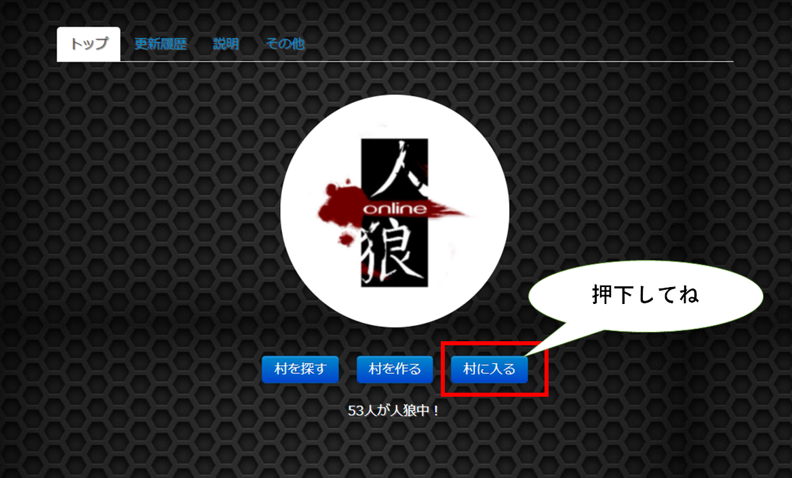
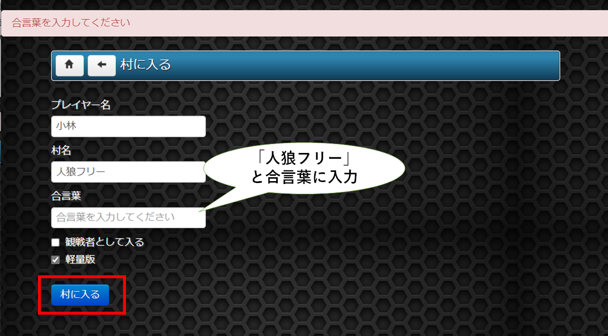
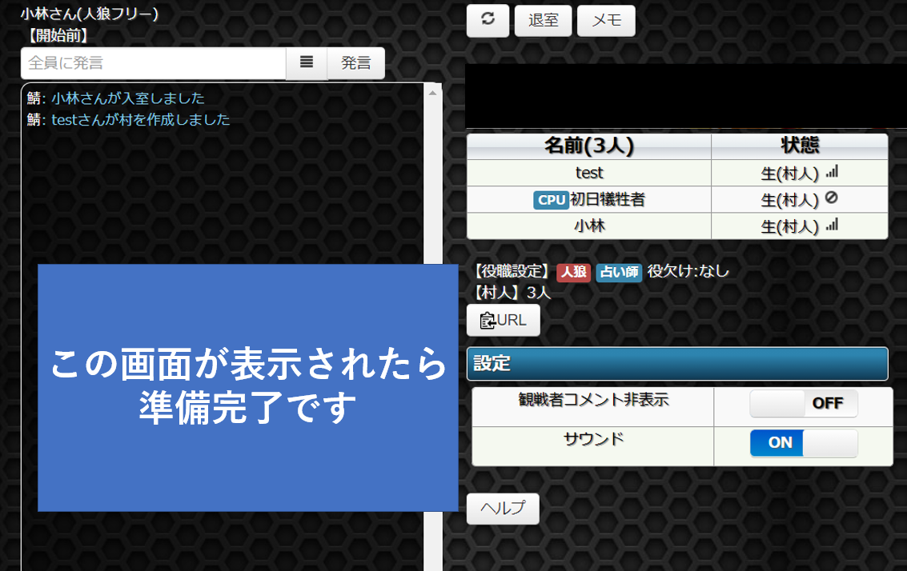

# FS 6月度レクリエーション案内

## 心理戦の駆け引き「オンライン人狼ゲーム」をみんなでやろう

**イベント開催日:** 6/19(土)   
**開場:** 12:50 ～  
**開始:** 13:00 ～   

### 人狼ゲームとは？

人狼ゲームとは、  
味方になりすましたウソつきを会話で見つけ出すパーティーゲームです 

必要なのは・・・
コミュニケーション・観察・説得力

与えられたミッションは・・・
「人間たちの中にまぎれこんだ人狼を見つけ出せ！」🤔 

 

## ⬛ 🕢 タイムテーブル

<table>
  <tr>
    <td>時刻</td>
    <td>所有時間</td>
    <td></td>
    <td>備考</td>
  </tr>
  <tr>
    <td>12:50</td>
    <td>ー</td>
    <td>開場</td>
    <td>こちらから入場ください FSオンラインボードゲーム大会</td>
  </tr>
  <tr>
    <td>13:00</td>
    <td>5分</td>
    <td>挨拶</td>
    <td></td>
  </tr>
  <tr>
    <td>13:05</td>
    <td>5分</td>
    <td>説明</td>
    <td></td>
  </tr>
  <tr>
    <td></td>
    <td></td>
    <td></td>
    <td></td>
  </tr>
  <tr>
    <td>13:10</td>
    <td>5分</td>
    <td>村に入る</td>
    <td>グループ確認(Aチーム)</td>
  </tr>
  <tr>
    <td>13:43</td>
    <td>最大33分</td>
    <td></td>
    <td>1ゲーム目(ラウンド3)</td>
  </tr>
  <tr>
    <td>13:45</td>
    <td></td>
    <td></td>
    <td>45分まで感想&amp;トイレ休憩</td>
  </tr>
  <tr>
    <td>13:50</td>
    <td>5分</td>
    <td>村に入る</td>
    <td>グループ確認(Cチーム)</td>
  </tr>
  <tr>
    <td>14:23</td>
    <td>最大33分</td>
    <td></td>
    <td>2ゲーム目(ラウンド3)</td>
  </tr>
  <tr>
    <td>14:25</td>
    <td></td>
    <td></td>
    <td>25分まで感想&amp;トイレ休憩</td>
  </tr>
  <tr>
    <td></td>
    <td></td>
    <td></td>
    <td></td>
  </tr>
  <tr>
    <td>14:30</td>
    <td>5分</td>
    <td></td>
    <td>おわりに</td>
  </tr>
</table>

 

## ⬛ 🕢 部屋への入り方

**人狼Online**:  
https://zinro.net/m/

 

## ⬛ 🕢 注意事項

### ゲームプレーヤーについて

- プレイヤーの方は最初、音声をONにして下さい。Teams の画面は見ないで下さい

- 噛まれた又は、処刑された場合は、音声をOFFにして下さい。自動的に霊界へ行くため、人狼オンライン内のチャットで人狼を予想しましょう

 

### 観戦者

- 観戦者の方は音声をOFFにしてください。Teams の共有画面を見ながら Teams のチャットで誰が人狼か、予想して下さい！！

 

## ⬛ 🕢 ゲームの流れについて

### 夜の時間の注意点【最大180秒】

- 人狼、占い師の人は必ず行動を行ってください。

行動せずに制限時間が終了してしまうと死亡してしまいます。  
※一度実行先を決めてしまうと選び直せないので注意しましょう

- 生存しているすべての役職の実行が終わると残り時間に関わらず夜は明けます。

 

### 昼の時間【300秒】

話し合いの時間です（心理戦）

 

### 投票の時間【最大120秒】

全員の投票終了したところで時間は終了し、処刑が行われます。

1. 全員の投票の中で一番多く票をもらった人が処刑されます

2. 処刑者が同票の場合はランダムに処刑します

3. 全員の投票が終わるまでは投票先を変更できます

※投票する前に時間切れになった場合、ランダム投票となります

 
